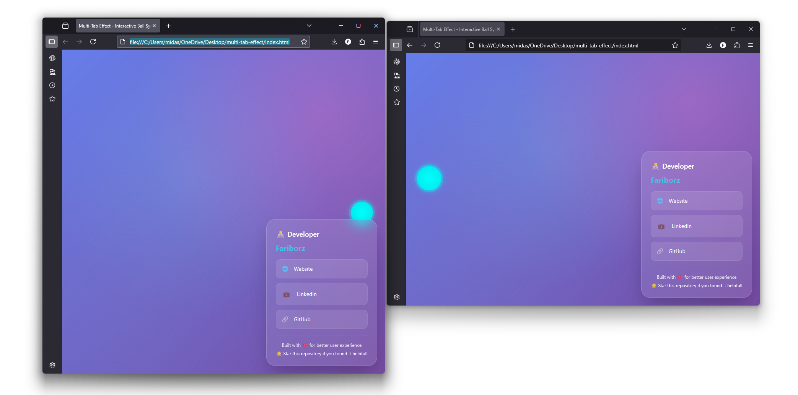

# 🎯 Multi-Tab Effect

A modern, interactive web application that demonstrates synchronized ball movement across multiple browser tabs. When you open this page in multiple tabs and position the windows close to each other, the balls will automatically synchronize and move to the edges, creating a fascinating visual effect.

## ✨ Features

- **Cross-Tab Synchronization**: Balls automatically sync between multiple browser windows
- **Smart Positioning**: Balls move to edges when windows are positioned close together
- **Modern Visual Effects**: Gradient backgrounds, glow effects, and smooth animations
- **Responsive Design**: Works perfectly on desktop and mobile devices
- **Interactive Controls**: Click anywhere to reset ball position
- **Real-time Communication**: Uses localStorage for seamless cross-tab communication
- **Modern UI Framework**: Built with Tailwind CSS for rapid development

## 🚀 How to Use

1. **Open Multiple Tabs**: Open `index.html` in several browser tabs
2. **Position Windows**: Arrange the browser windows close to each other
3. **Watch the Magic**: Observe how the balls automatically synchronize and move to the edges
4. **Interact**: Click anywhere on the screen to reset the ball to the center

## 🛠️ Technical Details

### Architecture
- **Frontend**: HTML5, Tailwind CSS, and JavaScript (ES6+)
- **Styling**: Tailwind CSS via CDN for modern utility-first styling
- **Communication**: localStorage API for cross-tab synchronization
- **Graphics**: HTML5 Canvas for smooth animations
- **Responsive**: Mobile-first design with Tailwind's responsive utilities

### Key Components

#### `index.html`
- Clean, semantic HTML structure
- Tailwind CSS classes for modern styling
- Glassmorphism effects with backdrop blur
- Responsive design with utility classes
- Proper meta tags for SEO and mobile optimization

#### `script.js`
- Object-oriented JavaScript using ES6 classes
- Smooth easing animations
- Real-time window position detection
- Dynamic ball positioning algorithms
- Interactive event handling

## 🎨 Visual Features

- **Gradient Background**: Beautiful purple-to-blue gradient with overlay effects
- **Glow Effects**: Balls emit light when synchronizing
- **Pulse Animation**: Subtle breathing effect on the balls
- **Smooth Movement**: Easing functions for natural ball motion
- **Glassmorphism UI**: Modern instruction overlay with blur effects
- **Tailwind Styling**: Utility-first CSS framework for rapid development

## 📱 Browser Compatibility

- ✅ Chrome/Chromium (recommended)
- ✅ Firefox
- ✅ Safari
- ✅ Edge
- ⚠️ Internet Explorer (not supported)

## 🔧 Installation

1. Clone or download this repository
2. Open `index.html` in your web browser
3. Open the same file in multiple tabs
4. Enjoy the synchronized effect!

## 🎯 How It Works

### Synchronization Algorithm
1. Each window generates a unique ID
2. Window positions are broadcast via localStorage every 100ms
3. When windows detect each other within 100px threshold:
   - Balls move to the nearest edge
   - Vertical positions are coordinated
   - Glow effects are activated

### Position Detection
```javascript
// Calculate window boundaries
const myLeft = window.screenX;
const myRight = window.screenX + window.outerWidth;
const threshold = 100;

// Check for proximity
if (Math.abs(myRight - otherLeft) < threshold) {
  // Move ball to right edge
}
```

## 🎨 Customization

### Colors
Modify the gradient in the `<style>` section of `index.html`:
```css
background: linear-gradient(135deg, #667eea 0%, #764ba2 100%);
```

### Tailwind Classes
Customize the UI by modifying Tailwind classes in `index.html`:
```html
<!-- Example: Change background opacity -->
<div class="bg-white/10"> <!-- 10% opacity -->
<div class="bg-white/20"> <!-- 20% opacity -->

<!-- Example: Change border radius -->
<div class="rounded-2xl"> <!-- Large radius -->
<div class="rounded-3xl"> <!-- Extra large radius -->
```

### Ball Properties
Adjust ball settings in `script.js`:
```javascript
this.ball = {
  r: 30,           // Radius
  color: '#00ffff', // Color
  glow: 0,         // Glow intensity
  pulse: 0         // Pulse animation
};
```

### Animation Speed
Change the easing factor:
```javascript
const easing = 0.08; // Lower = slower, Higher = faster
```

## 🎨 Tailwind Features Used

- **Glassmorphism**: `bg-white/10 backdrop-blur-lg`
- **Gradients**: `bg-gradient-to-r from-cyan-400 to-pink-400`
- **Transitions**: `transition-all duration-300`
- **Hover Effects**: `hover:-translate-y-1 hover:translate-x-1`
- **Responsive Design**: Built-in responsive utilities
- **Modern Shadows**: `shadow-2xl shadow-3xl`

## 🤝 Contributing

1. Fork the repository
2. Create a feature branch
3. Make your changes
4. Test thoroughly
5. Submit a pull request

## 📄 License

This project is open source and available under the [MIT License](LICENSE).

## 🙏 Acknowledgments

- HTML5 Canvas API for smooth graphics
- localStorage API for cross-tab communication
- Tailwind CSS for modern utility-first styling
- ES6+ JavaScript for clean, maintainable code

## 📞 Support

If you have any questions or suggestions, feel free to open an issue or contact the developer.

---

## 👨‍💻 Developer

**Fariborz**

- 🌐 **Website**: [fariborzz.ir](https://fariborzz.ir)
- 💼 **LinkedIn**: [fariborzamm](https://www.linkedin.com/in/fariborzamm)
- 🔗 **GitHub**: [fariborz0015](https://github.com/fariborz0015)

---

<div align="center">
  <p>Built with ❤️ for better user experience</p>
  <p>⭐ Star this repository if you found it helpful!</p>
</div> 
